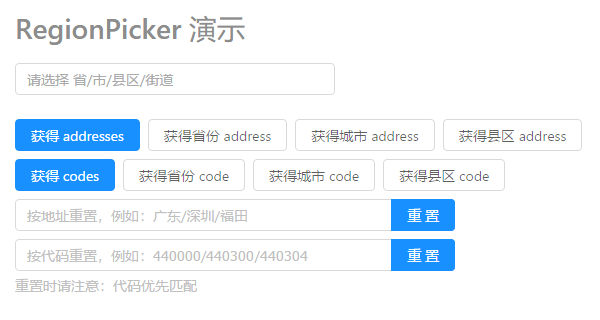
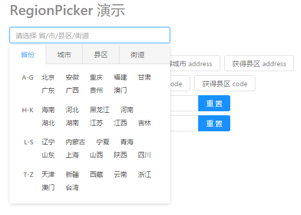
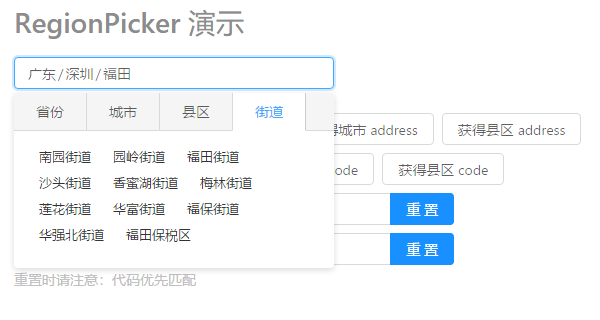

# Taobao-Area-CSharp
淘宝国家省市区街道获取

> 参考 [foxiswho](https://github.com/foxiswho) 的 [taobao-area-php](https://github.com/foxiswho/taobao-area-php) 部分代码，改由c#重构。

引用如下：

> - Autofac 
> - MediatR 
> - Swagger 
> - HangFire 生成街道数据爬取任务。

## 演示

[https://akinix.github.io/Taobao-Area-CSharp/index.html](https://akinix.github.io/Taobao-Area-CSharp/index.html)

前端源码稍后上传,请关注 [**deepfunc**](https://github.com/deepfunc)

## 目的

为了方便获取中国大陆及港澳台省市区县街道相关数据，根据 [淘宝地址js](https://g.alicdn.com/vip/address/6.0.14/index-min.js),解析并生成相关数据。

## 设置

所有设置都在 `appsettings.json` 中

|                      | 说明                                      | 默认值                                      |
| -------------------- | --------------------------------------- | ---------------------------------------- |
| TaobaoJsVersion      | 淘宝js的版本，方便淘宝js更新后修改                     | 6.0.14                                   |
| TaobaoAreaJsUrl      | 默认值中有占位符，会替换为TaobaoJsVersion的值          | https://g.alicdn.com/vip/address/{0}/index-min.js |
| JsDirectoryName      | 生成的相关js及json文件的目录                       | js                                       |
| JsTemplate           | 生成的js模版                                 | 见代码                                      |
| AreaPickerDataJsName | 生成的js文件名，默认值中有占位符，会替换为TaobaoJsVersion的值 | area.picker.data.{0}.js                  |
| TaobaoStreetUrl      | 爬取街道使用的url                              | https://lsp.wuliu.taobao.com/locationservice/addr/output_address_town_array.do?l1={0}&l2={1}&l3={2} |
| TempDirectoryName    | 临时目录，下载淘宝js用                            | temp                                     |

## 使用

1. 克隆或下载代码，打开解决方案。

2. `F5` 或 `Ctrl+F5` 调试代码。

3. 访问[http://localhost:55516/](http://localhost:55516/) ,默认会进入Swagger页面。

   

4. 再打开一个新页面,访问Hangfire面板 [http://localhost:55516/hangfire/jobs/enqueued](http://localhost:55516/hangfire/jobs/enqueued)

   

5. 如需演示整个流程，请在Swagger页面，执行 `/api/v1/TaobaoAreas/ReBuild` 

   

## 流程说明

